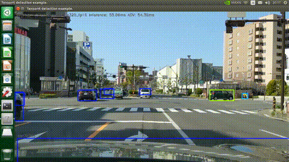
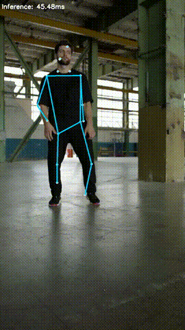
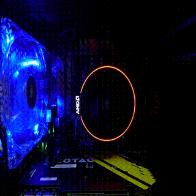
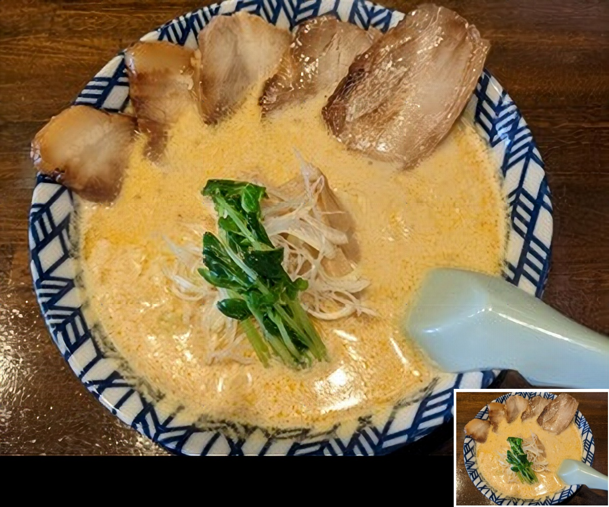
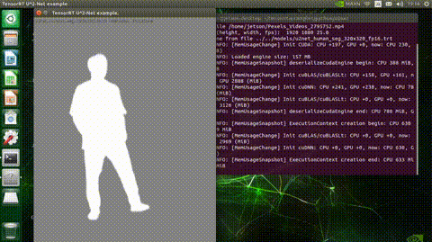
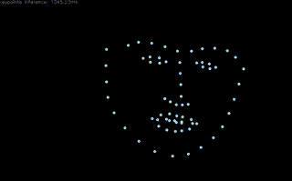
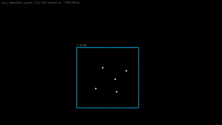

# TensorRT Examples

## About
TensorRT examples (Jetson, Python/C++)

## List of samples

|Object detection|Pose estimation|
|:--|:--|
|[TensorFlow Lite to TensorRT SSDLite](python/detection/README.md)|[TensorFLow Lite to TensorRT PoseNet](python/posenet/README.md)
|||

|MIRNet|ESRGAN|
|:--|:--|
|[TensorFlow Lite to TensorRT MIRNet](python/mirnet/README.md)|[ONNX to TensorRT ESRGAN](python/esrgan/README.md)|[ONNX to TensorRT ESRGAN](python/esrgan/README.md)|
||||

|U^2-Net|
|:--|
|[ONNX to TensorRT U^2-Net](python/u2net/README.md)|
||

|Face landmark|Yu-Net|
|:--|:--|
|[ONNX to TensorRT Face landmark](python/face_landmark/README.md)|[ONNX to TensorRT Yu-Net](python/yunet/README.md)|
|||

## LICENSE
The following files are licensed under [NVIDIA/TensorRT](https://github.com/NVIDIA/TensorRT).
- [common.py](python/detection/common.py)
  
## Reference
- [TensorRT](https://github.com/NVIDIA/TensorRT)
- [ONNX](https://github.com/onnx/onnx)
- [ONNX Runtime](https://github.com/microsoft/onnxruntime)
- [tf2onnx](https://github.com/onnx/tensorflow-onnx)
- [TensorRT Backend For ONNX](https://github.com/onnx/onnx-tensorrt)
- [TensorFlow Model Garden](https://github.com/tensorflow/models)