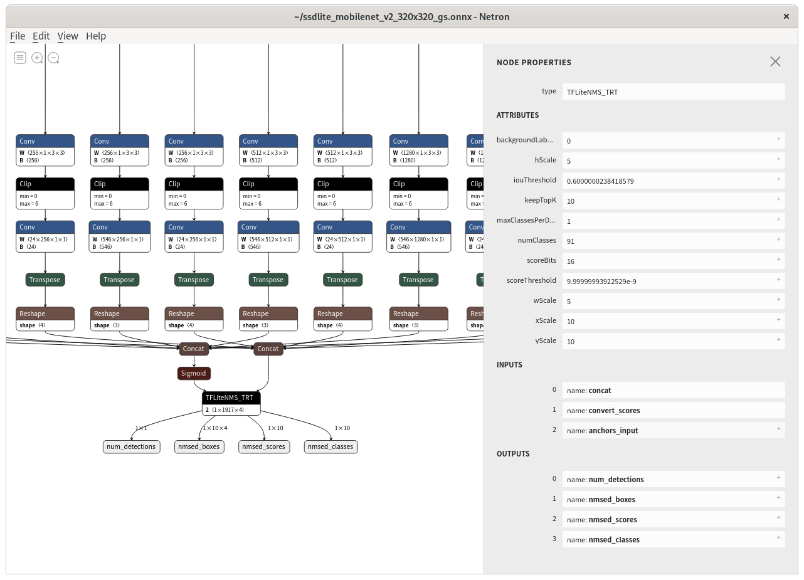

# TensorRT (TensorFlow 1 TensorFlow Lite Detection Model)

## Description
This sample contains code and a notebook that convert TensorFlow Lite Detection model to ONNX model and performs TensorRT inference on Jetson.
1. Export TensorFlow Lite Detection Model.
2. Convert to ONNX Model.
3. Add TensorRT TFLiteNMS Plugin to ONNX Model.
4. Build TensorRT Plugins.
5. Convert ONNX Model to Serialize engine and inference on Jetson.

[tf2onnx](https://github.com/onnx/tensorflow-onnx) converts TensorFlow Lite models to ONNX models. This allows inference in TensorRT using the TensorFlow Lite model.
However, [TensorRT 7 does not support NonMaxSuppression](https://github.com/onnx/onnx-tensorrt/blob/7.2.1/docs/operators.md), so it is not possible to run the detection model. TensorRT's [batchedNMSPlugin](https://github.com/NVIDIA/TensorRT/tree/master/plugin/batchedNMSPlugin) and [nmsPlugin](https://github.com/NVIDIA/TensorRT/tree/master/plugin/nmsPlugin) are not compatible with TensorFlow Lite's TFLite_Detection_PostProcess.
Therefore, create a plugin [TFLiteNMS_TRT](https://github.com/NobuoTsukamoto/TensorRT-1/tree/tflite-nms/plugin/tfliteNMSPlugin) to run the TensorFlow Lite detection model.


## Environment
- Host PC
  - Linux (Ubuntu 18.04) or Google Colab
- Jetson
  - JetPack 4.5.1

## Convert ONNX Model on your Host PC

The following is executed on the Host PC.  
[The Add_TFLiteNMS_Plugin notebook](Add_TFLiteNMS_Plugin.ipynb) contains all the steps to convert from TensorFlow Lite to the ONNX with TFLite NMS Plugin model.

### Export TensorFlow Lite model

Install TensorFlow and Object Detection API with TensorFlow 1.
```
sudo apt update
sudo apt install protobuf-compiler
pip3 install tensorflow==1.15 tensorflow-addons

git clone https://github.com/tensorflow/models.git
export PYTHONPATH=`pwd`/models:$PYTHONPATH
cd models/research
protoc object_detection/protos/*.proto --python_out=.
cp object_detection/packages/tf1/setup.py .
python3 -m pip install .
```

Download SSDLite MobileNet V2 checkpoint.
```
wget http://download.tensorflow.org/models/object_detection/ssdlite_mobilenet_v2_coco_2018_05_09.tar.gz
tar xf ssdlite_mobilenet_v2_coco_2018_05_09.tar.gz
```

Export TF-Lite FP32 Model.  
Note: Specify Float for `inference_input_type` and TFLite_Detection_PostProcess for `output_arrays`.
```
python3 object_detection/export_tflite_ssd_graph.py \
    --pipeline_config_path="./ssdlite_mobilenet_v2_coco_2018_05_09/pipeline.config" \
    --trained_checkpoint_prefix="./ssdlite_mobilenet_v2_coco_2018_05_09/model.ckpt" \
    --output_directory="./ssdlite_mobilenet_v2_coco_2018_05_09/tflite" \
    --add_postprocessing_op=true

tflite_convert \
    --enable_v1_converter \
    --graph_def_file="./ssdlite_mobilenet_v2_coco_2018_05_09/tflite/tflite_graph.pb" \
    --output_file="./ssdlite_mobilenet_v2_coco_2018_05_09/tflite/ssdlite_mobilenet_v2_300x300.tflite" \
    --inference_input_type=FLOAT \
    --inference_type=FLOAT \
    --input_arrays="normalized_input_image_tensor" \
    --output_arrays="TFLite_Detection_PostProcess,TFLite_Detection_PostProcess:1,TFLite_Detection_PostProcess:2,TFLite_Detection_PostProcess:3" \
    --input_shapes=1,300,300,3 \
    --allow_nudging_weights_to_use_fast_gemm_kernel=true \
    --allow_custom_op
```

### Convert ONNX Model

Install onnxruntime and tf2onnx.
```
pip3 install onnxruntime tf2onnx
```

Convert TensorFlow Lite Model to ONNX Model.  
Note: TensorRT 7.2 supports operators up to Opset 11.
```
python3 -m tf2onnx.convert --opset 11 \
    --tflite ./ssdlite_mobilenet_v2_coco_2018_05_09/tflite/ssdlite_mobilenet_v2_300x300.tflite \
    --output ./ssdlite_mobilenet_v2_coco_2018_05_09/onnx/ssdlite_mobilenet_v2_300x300.onnx
```

### Add TFLiteNSMPlugin to ONNX Model. 
Install onnx_graphsurgeon.
```
python3 -m pip install onnx_graphsurgeon --index-url https://pypi.ngc.nvidia.com
```

Clone this repository.
```
git clone https://github.com/NobuoTsukamoto/tensorrt-examples
cd ./tensorrt-examples/python/detection
```

Add TFLiteNMSPlugin.
```
python3 add_tensorrt_tflitenms_plugin.py \
    --input ../../../ssdlite_mobilenet_v2_coco_2018_05_09/onnx/ssdlite_mobilenet_v2_300x300.onnx \
    --output ../../../ssdlite_mobilenet_v2_coco_2018_05_09/onnx/ssdlite_mobilenet_v2_300x300_gs.onnx
```

If you check the converted ssdlite_mobilenet_v2_300x300_gs.onnx in [Netron](https://netron.app/), you can see that `NonMaxSuppression` has been replaced by `TFLiteNMS_TRT`.


<br>
The full options for [add_tensrrt_tflitenms_plugin.py](add_tensorrt_tflitenms_plugin.py) are:
```
python add_tensorrt_tflitenms_plugin.py --help
usage: add_tensorrt_tflitenms_plugin.py [-h] --input INPUT --output OUTPUT [--max_classes_per_detection MAX_CLASSES_PER_DETECTION]
                                        [--max_detections MAX_DETECTIONS] [--background_label_id BACKGROUND_LABEL_ID] [--nms_iou_threshold NMS_IOU_THRESHOLD]
                                        [--nms_score_threshold NMS_SCORE_THRESHOLD] [--num_classes NUM_CLASSES] [--y_scale Y_SCALE] [--x_scale X_SCALE]
                                        [--h_scale H_SCALE] [--w_scale W_SCALE] [--efficientdet]

optional arguments:
  -h, --help            show this help message and exit
  --input INPUT         Input ONNX model path.
  --output OUTPUT       Output ONXX (Add TFLIteNMS_TRT) model path.
  --max_classes_per_detection MAX_CLASSES_PER_DETECTION
                        TFLite_Detection_PostProcess Attributes "detections_per_class".
  --max_detections MAX_DETECTIONS
                        TFLite_Detection_PostProcess Attributes ""
  --background_label_id BACKGROUND_LABEL_ID
                        Background Label ID(TF 1 Detection Model is 0).
  --nms_iou_threshold NMS_IOU_THRESHOLD
                        TFLite_Detection_PostProcess Attributes "nms_iou_threshold"
  --nms_score_threshold NMS_SCORE_THRESHOLD
                        TFLite_Detection_PostProcess Attributes "nms_score_threshold"
  --num_classes NUM_CLASSES
                        TFLite_Detection_PostProcess Attributes "num_classes"
  --y_scale Y_SCALE     TFLite_Detection_PostProcess Attributes "y_scale"
  --x_scale X_SCALE     TFLite_Detection_PostProcess Attributes "x_scale"
  --h_scale H_SCALE     TFLite_Detection_PostProcess Attributes "h_scale"
  --w_scale W_SCALE     TFLite_Detection_PostProcess Attributes "w_scale"
  --efficientdet        Currently not supported.
```
The parameters of TFLiteNMS_TRT are similar to those of TFLite_Detection_PostProcess.
However, keep in mind that making nms_score_threshold too small will significantly increase the inference time.


## Build TensorRT Plugins and Run Jetson Nano

The following is executed on Jetson (JetPack 4.5.1).

### Install dependency
Install the software needed to build TensorRT.  
Note: Jetson's pre-installed CMake is 3.10.2, but TensorRT requires 3.13 or higher, so install it from snap.
```
sudo apt remove cmake
sudo snap install cmake --classic
sudo reboot
```

### Clone this repository and Build TensorRT.
Clone repository and init submodule.
```
cd ~
git clone https://github.com/NobuoTsukamoto/tensorrt-examples
cd ./tensorrt-examples
git submodule update --init --recursive
```

Now build TensorRT.
```
export TRT_LIBPATH=`pwd`/TensorRT
export PATH=${PATH}:/usr/local/cuda/bin
cd $TRT_LIBPATH
mkdir -p build && cd build
cmake .. -DTRT_LIB_DIR=$TRT_LIBPATH -DTRT_OUT_DIR=`pwd`/out -DTRT_PLATFORM_ID=aarch64 -DCUDA_VERSION=10.2 -DCMAKE_BUILD_TYPE=Release -DCMAKE_C_COMPILER=/usr/bin/gcc
make -j$(nproc)
```

At this time, Jetpack 4.5.1 TensorRT 7.1.3 does not support FP16 for NMS. Therefore, copy only the plugin.
```
sudo cp out/libnvinfer_plugin.so.7.2.3 /usr/lib/aarch64-linux-gnu/
sudo rm /usr/lib/aarch64-linux-gnu/libnvinfer_plugin.so.7
sudo ln -s /usr/lib/aarch64-linux-gnu/libnvinfer_plugin.so.7.2.3 /usr/lib/aarch64-linux-gnu/libnvinfer_plugin.so.7
```

Copy `ssdlite_mobilenet_v2_300x300_gs.onnx` to jetson and check model.
```
/usr/src/tensorrt/bin/trtexec --onnx=/home/jetson/tensorrt-examples/models/ssdlite_mobiledet_gpu_300x300_gs.onnx
```

Install pycuda.  
See details:
- [pycuda installation failure on jetson nano - NVIDIA FORUMS](https://forums.developer.nvidia.com/t/pycuda-installation-failure-on-jetson-nano/77152/22)
```
sudo apt install python3-dev
pip3 install --global-option=build_ext --global-option="-I/usr/local/cuda/include" --global-option="-L/usr/local/cuda/lib64" pycuda
```

Convert to Serialize engine file.  
If you want to convert to FP16 model, add --fp16 to the argument of `convert_onnxgs2trt.py`.
```
cd ~/tensorrt-examples/python/detection/
python3 convert_onnxgs2trt.py \
    --model /home/jetson/tensorrt-examples/models/ssdlite_mobilenet_v2_300x300_gs.onnx \
    --output /home/jetson/tensorrt-examples/models/ssdlite_mobilenet_v2_300x300_fp16.trt \
    --fp16
```

Finally you can run the demo (width and height options are model input).
```
python3 trt_detection.py \
    --model ../../models/ssdlite_mobilenet_v2_300x300_fp16.trt \
    --label ../../models/coco_labels.txt \
    --width 300 \
    --height 300
```
